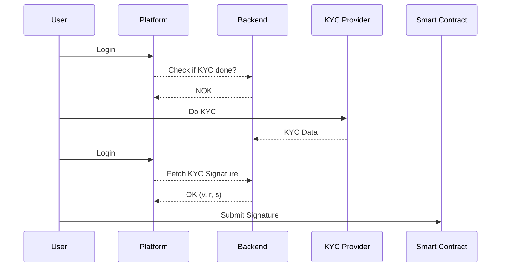

# TokenVest

This Dapp use the standart ERC 1155 to tokenize real estate assets. By combining the power of blockchain technology and smart contracts, this project aims to revolutionize the traditional real estate industry by introducing greater liquidity, accessibility, and efficiency.

## Smart Contracts

### Deployed Contracts (testnet)

You can find the list of deployed contract addresses [here](./contracts/scripts/config.json).

### Running Tests

```shell
cd contracts
npm install
npm test
```

## KYC


