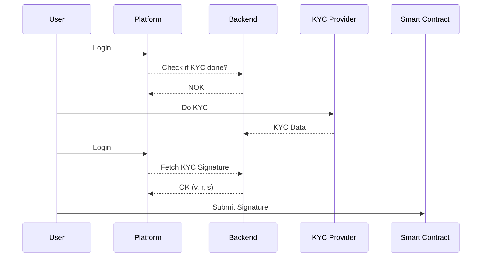

# TokenVest by ShitCoinShacks

ERC-1155 for the apartment
KYC contract
PayoutSettlementContract => money arrives there and flag is set for "payout claimable"
ListingContract
TradingContract

TODO: Reginald => out of the box multisig capabilities

## KYC

