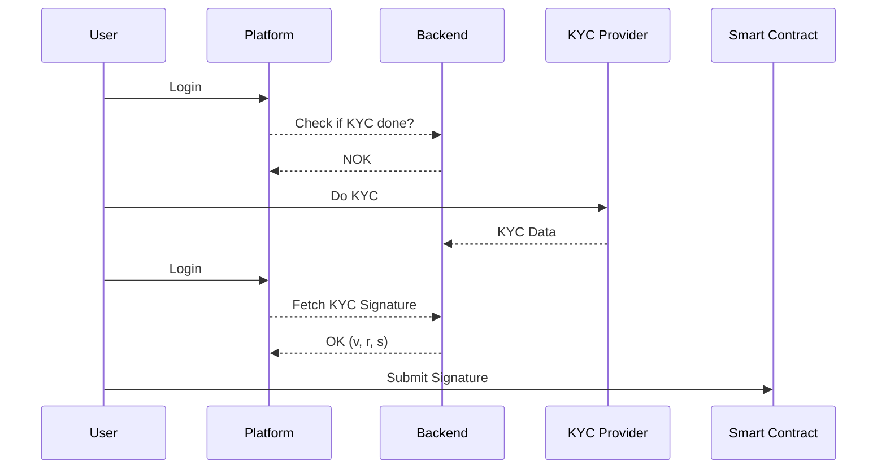

# TokenVest

## Smart Contracts

### Deployed Contracts (testnet)

You can find the list of deployed contract addresses [here](./contracts/scripts/config.json).

### Running Tests

```shell
cd contracts
npm install
npm test
```

## KYC


